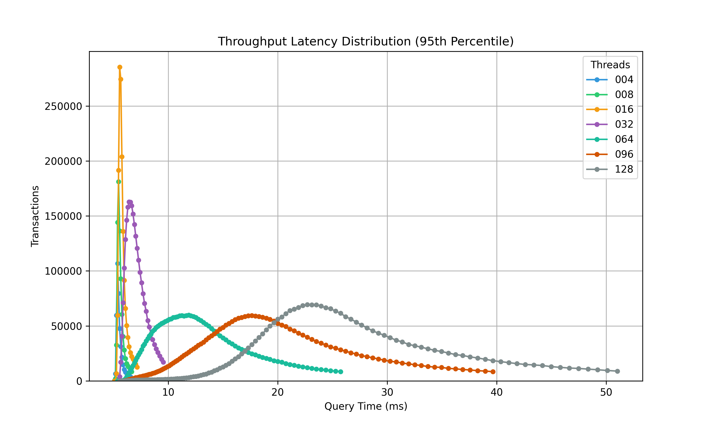
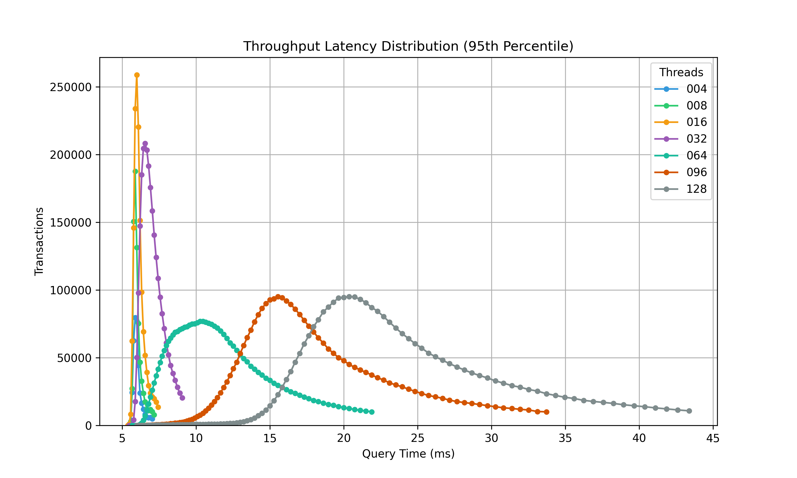
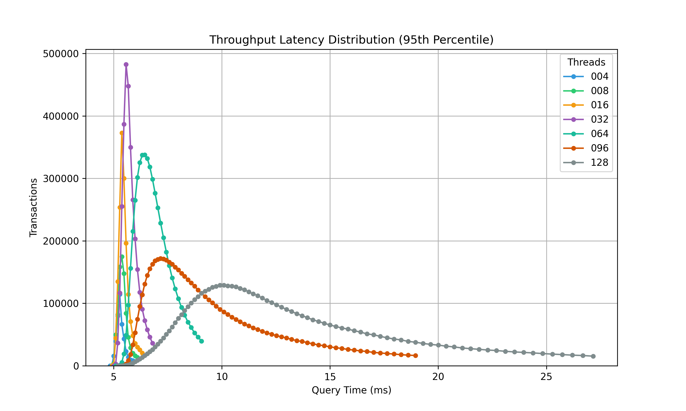

# AWS RDS MySQL Tests

## Overview

- Comparing RDS Instances with 8 vCPUs
- 4, 8, 16, 32, 64, 96, 128 Thread tests
- Increase in transaction throughput per instance type
- Significant perform boosts using `r7g` and `r8g` at higher thread count.
- 100% increase using `r8g` over `m5`, 40% using `r7g` over `m5`.


## Summary of Tests

|   Threads |   rds-mysql-m5.2xlarge |  rds-mysql-r6g.2xlarge |   rds-mysql-r7g.2xlarge |   rds-mysql-r8g.2xlarge |   rds-mysql-r6g.2xlarge Improvement (%) |   rds-mysql-r7g.2xlarge Improvement (%) |   rds-mysql-r8g.2xlarge Improvement (%) |
|----------:|-----------------------:|------------------------:|------------------------:|------------------------:|----------------------------------------:|----------------------------------------:|----------------------------------------:|
|         4 |                    711 |                     653 |                     687 |                     741 |                                   -8.16 |                                   -3.38 |                                    4.22 |
|         8 |                   1398 |                    1306 |                    1359 |                    1456 |                                   -6.58 |                                   -2.79 |                                    4.15 |
|        16 |                   2701 |                    2559 |                    2688 |                    2882 |                                   -5.26 |                                   -0.48 |                                    6.7  |
|        32 |                   4439 |                    4480 |                    4997 |                    5470 |                                    0.92 |                                   12.57 |                                   23.23 |
|        64 |                   4725 |                    5256 |                    6556 |                    9112 |                                   11.24 |                                   38.75 |                                   92.85 |
|        96 |                   4671 |                    5065 |                    6481 |                    9531 |                                    8.44 |                                   38.75 |                                  104.05 |
|       128 |                   4588 |                    5092 |                    6393 |                    9383 |                                   10.99 |                                   39.34 |                                  104.51 |


# Thread Throughput
## rds-mysql-m5.2xlarge


## rds-mysql-r6g.2xlarge


## rds-mysql-r7g.2xlarge


##rds-mysql-r8g.2xlarge


# Latency Distribution
## rds-mysql-m5.2xlarge



## rds-mysql-r6g.2xlarge



## rds-mysql-r7g.2xlarge


##rds-mysql-r8g.2xlarge



## Execution times of DB Sizings

Times in ET
```
[2025-03-20 10:54:24] aws rds modify-db-instance --db-instance-identifier mysql-cable --db-instance-class db.r7g.2xlarge --apply-immediately
[2025-03-20 14:58:23] aws rds modify-db-instance --db-instance-identifier mysql-cable --db-instance-class db.r6g.2xlarge --apply-immediately
[2025-03-20 18:31:48] aws rds modify-db-instance --db-instance-identifier mysql-cable --db-instance-class db.r8g.2xlarge --apply-immediately
[2025-03-20 20:20:30] aws rds modify-db-instance --db-instance-identifier mysql-cable --db-instance-class db.m5.2xlarge --apply-immediately
```
