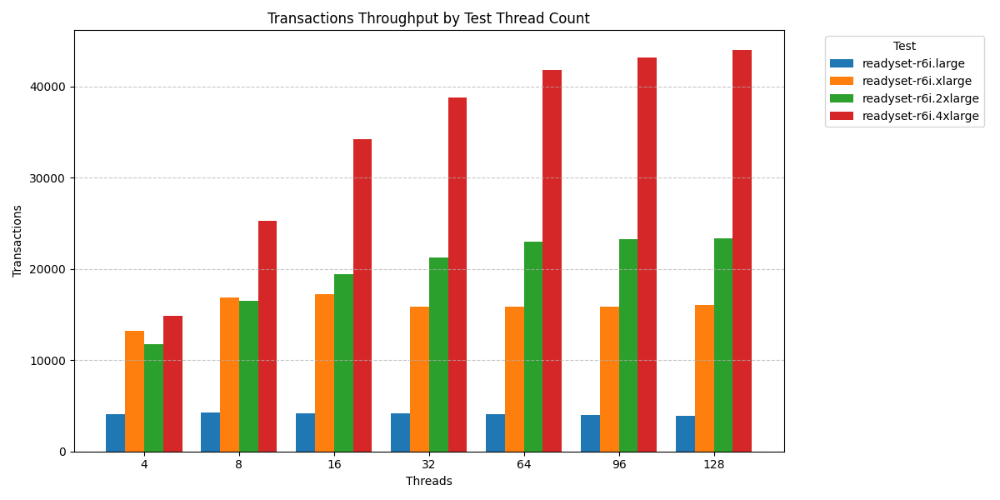
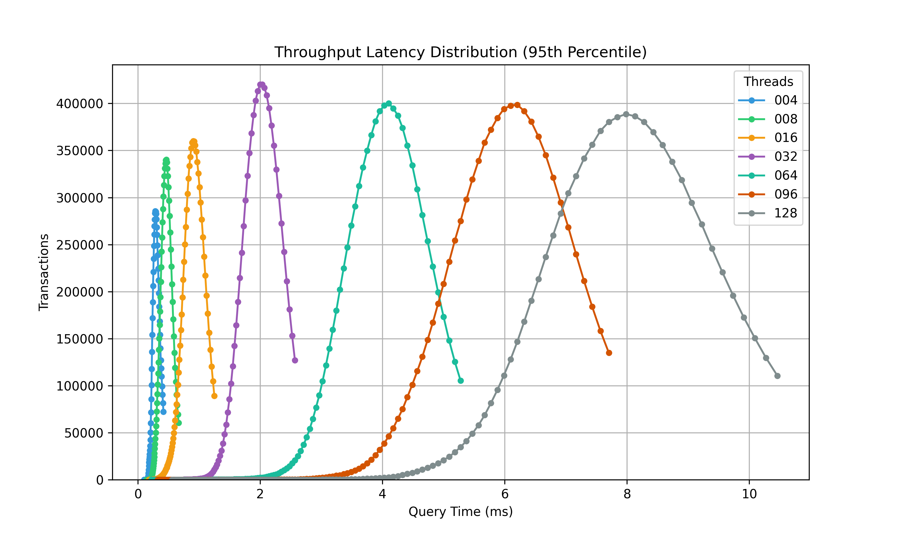

# AWS Readyset Tests with AWS RDS MySQL

## Overview

- Comparing EC2 `r6i` instance types
- 4, 8, 16, 32, 64, 96, 128 Thread tests
- Increase in transaction throughput per instance type
- Readyset did not show improved performance using a 2 vCPU machine
- Increase in threads > 128 needed for 8+ vCPUs



## Summary of Tests

- Initial testing started with `r6i.xlarge` (4 vCPUs). Tests at 2 vCPUs found disappointing drop in relative throughput. Further investigation required.

# Thread Throughput
## readyset-r6i.large (2 vCPUs)

## readyset-r6i.xlarge (4 vCPUs)

## readyset-r6i.2xlarge (8 vCPUs)


# Latency Distribution
## readyset-r6i.large (2 vCPUs)

## readyset-r6i.xlarge (4 vCPUs)

## readyset-r6i.2xlarge (8 vCPUs)


## Readyset GraphViz


## Readyset Domains

```
--------------
explain domains
--------------

+--------+------------------------+
| domain | worker                 |
+--------+------------------------+
| 14.0.0 | http://127.0.0.1:6033/ |
| 9.0.0  | http://127.0.0.1:6033/ |
| 1.0.0  | http://127.0.0.1:6033/ |
| 12.0.0 | http://127.0.0.1:6033/ |
| 7.0.0  | http://127.0.0.1:6033/ |
| 4.0.0  | http://127.0.0.1:6033/ |
| 3.0.0  | http://127.0.0.1:6033/ |
| 6.0.0  | http://127.0.0.1:6033/ |
| 10.0.0 | http://127.0.0.1:6033/ |
| 2.0.0  | http://127.0.0.1:6033/ |
| 5.0.0  | http://127.0.0.1:6033/ |
| 13.0.0 | http://127.0.0.1:6033/ |
| 0.0.0  | http://127.0.0.1:6033/ |
| 8.0.0  | http://127.0.0.1:6033/ |
| 11.0.0 | http://127.0.0.1:6033/ |
+--------+------------------------+
15 rows in set (0.00 sec)
```

## Readyset Materializations

```
--------------
explain materializations
--------------

+--------------+------------+---------------------------+----------------------------------------------------------------------------------------+-----------+------------+---------+------------------------------------------+
| domain_index | node_index | node_name                 | node_description                                                                       | keys      | size_bytes | partial | indexes                                  |
+--------------+------------+---------------------------+----------------------------------------------------------------------------------------+-----------+------------+---------+------------------------------------------+
| 9            |         10 | imdb.title_principal      | B                                                                                      | ~89736004 | 4998211313 |       0 | HashMap[0, 1, 2], HashMap[0], HashMap[1] |
| 7            |          8 | imdb.title_name_character | B                                                                                      | ~43605612 | 2436776981 |       0 | HashMap[0], HashMap[2], HashMap[1]       |
| 4            |          5 | imdb.title                | B                                                                                      | ~11131061 |  751945539 |       0 | HashMap[0], HashMap[2, 3]                |
| 5            |          6 | imdb.title_genre          | B                                                                                      | ~17408190 |  483418493 |       0 | HashMap[0]                               |
| 8            |          9 | imdb.name                 | B                                                                                      | ~14235647 |  478493827 |       0 | HashMap[0]                               |
| 6            |          7 | imdb.title_rating         | B                                                                                      | ~1518890  |   28396830 |       0 | HashMap[0]                               |
| 4            |         45 | q_af34021134694bc_n29     | →|                                                                                     | 2357      |    8499586 |       1 | HashMap[0]                               |
| 8            |         43 | imdb.title_principal      | →|                                                                                     | 2357      |    5111183 |       1 | HashMap[1], HashMap[0]                   |
| 4            |         29 | q_e639fb0e7684abdb_n22    | [33:0, 33:1, 33:2, 33:3, 5:1, 5:2, 5:3, 5:4, 5:5, 5:6, 5:7, 5:8, 5:9] 33:(1) ⋈ 5:(0)   | 963       |    4472917 |       1 | HashMap[2], HashMap[5, 6]                |
| 14           |         42 | q_415b6a680a2b66dd        | R                                                                                      | 963       |    4382291 |       1 | HashMap[2, 3]                            |
| 13           |         32 | q_e98213f9fe7761ad        | R                                                                                      | 963       |    2081082 |       1 | HashMap[2, 3]                            |
| 4            |         35 | imdb.name                 | →|                                                                                     | 11557     |    1749462 |       1 | HashMap[0]                               |
| 4            |         33 | imdb.title_name_character | →|                                                                                     | 2357      |    1653868 |       1 | HashMap[1], HashMap[2]                   |
| 10           |         12 | q_d4ac544dd05a54f6        | R                                                                                      | 963       |     670186 |       1 | HashMap[2, 3]                            |
| 11           |         17 | q_e9be53304cb3503b        | R                                                                                      | 963       |     583539 |       1 | HashMap[1, 2]                            |
| 6            |         25 | imdb.title                | →|                                                                                     | 963       |     523810 |       1 | HashMap[2, 3], HashMap[0]                |
| 12           |         24 | q_9e534bf4da3adc8c        | R                                                                                      | 963       |     366995 |       1 | HashMap[3, 0]                            |
| 4            |         18 | imdb.title_genre          | →|                                                                                     | 2357      |     322960 |       1 | HashMap[0]                               |
| 2            |          3 | imdb.title_rating         | ☒                                                                                      | 0         |          0 |       0 | HashMap[0]                               |
| 3            |          4 | imdb.title_principal      | ☒                                                                                      | 0         |          0 |       0 | HashMap[0, 1, 2]                         |
| 1            |          2 | imdb.title_genre          | ☒                                                                                      | 0         |          0 |       0 | HashMap[0]                               |
| 0            |          1 | imdb.title                | ☒                                                                                      | 0         |          0 |       0 | HashMap[0]                               |
+--------------+------------+---------------------------+----------------------------------------------------------------------------------------+-----------+------------+---------+------------------------------------------+
22 rows in set (0.00 sec)
```
